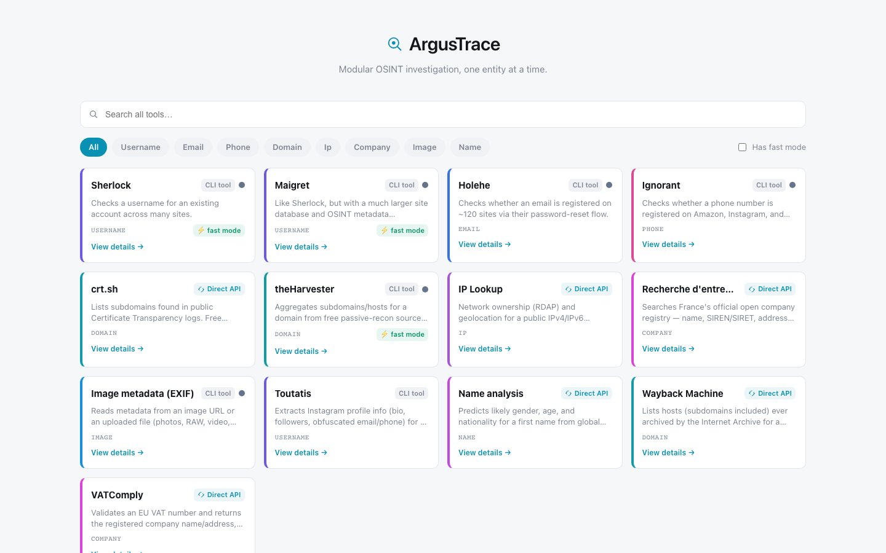
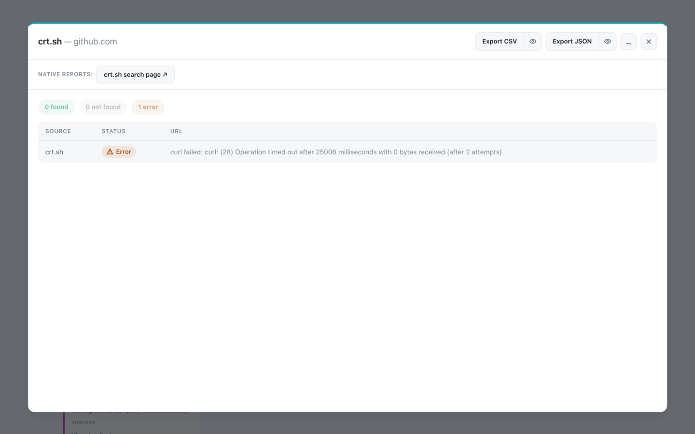
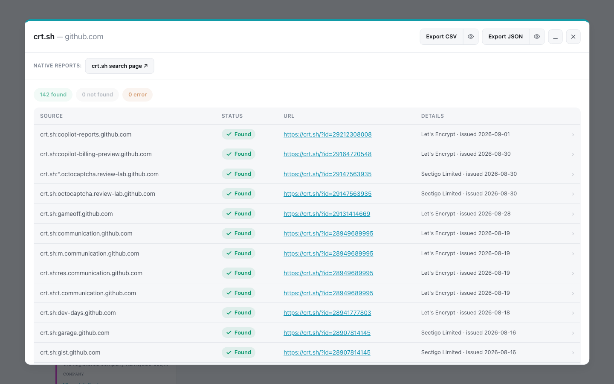
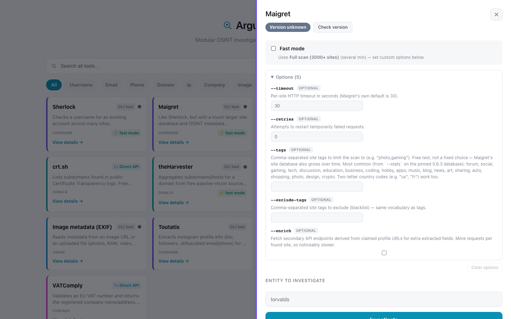
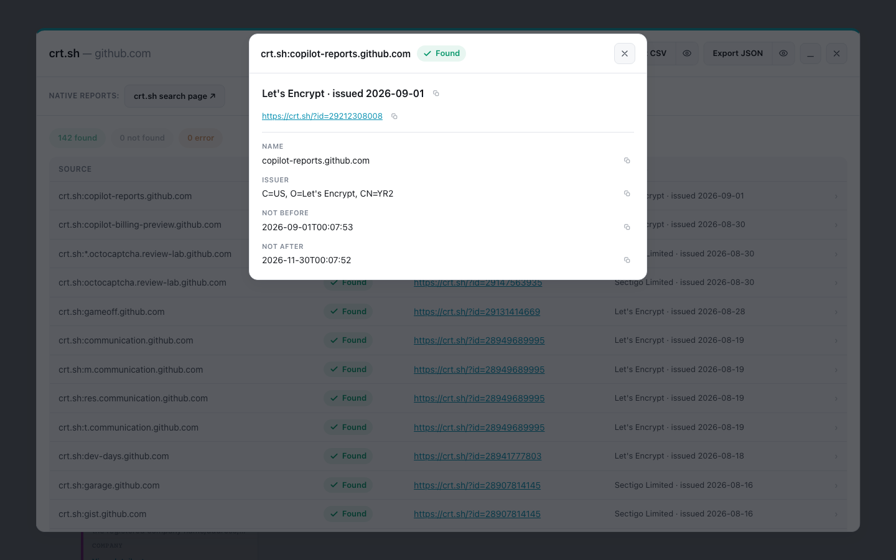
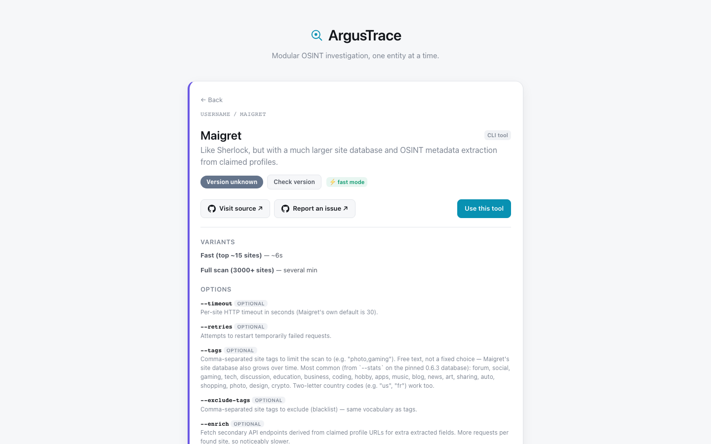

# ArgusTrace

[](https://github.com/0p3r1/ArgusTrace/actions/workflows/ci.yml)


**A modular OSINT framework that refuses to guess.**

Thirteen real OSINT tools behind one plugin registry, driving both a CLI and a
web app. Every tool runs in a hardened, single-use Docker container — never on
your machine. Every result comes back as a **tri-state** `Finding`:
`FOUND` / `NOT_FOUND` / `ERROR`. Never a boolean, never an inferred negative.

<picture>
  <source media="(prefers-color-scheme: dark)" srcset="docs/screenshots/catalog-dark.png">
  
</picture>

## The idea

Most OSINT tooling collapses three different outcomes into two. "No result"
and "the lookup failed" get reported the same way, and a rate-limited API or a
container that died becomes a confident "nothing found". That is a false
negative, and in an investigation it is the most expensive kind of wrong.

ArgusTrace keeps them apart everywhere:

| Status      | Means                          |
| ----------- | ------------------------------ |
| `FOUND`     | Checked, and it exists.        |
| `NOT_FOUND` | Checked, and it does not.      |
| `ERROR`     | **Could not check.** Not the same as "no".  |

So when crt.sh times out, you see this — not an empty result set:

<picture>
  <source media="(prefers-color-scheme: dark)" srcset="docs/screenshots/error-state-dark.png">
  
</picture>

A timeout, a missing binary, a rate-limit body that happens to parse as valid
JSON — all of it becomes `ERROR` with a reason attached. `run()` never raises,
so one broken plugin cannot take down a run, and it never fabricates a result
to stay quiet.

And when it works, you get the findings with their full evidence:

<picture>
  <source media="(prefers-color-scheme: dark)" srcset="docs/screenshots/results-dark.png">
  
</picture>

## Tools

| Tool                    | Entity   | `--plugin` key          | Speed       | Notes                                                         |
| ----------------------- | -------- | ----------------------- | ----------- | ------------------------------------------------------------- |
| Demo                    | any      | `mock`                  | instant     | no network, proves the pipeline                               |
| Sherlock                | username | `sherlock`              | ~5s         | curated ~10-site list                                         |
| Sherlock (full)         | username | `sherlock-full`         | 1-3 min     | ~400+ sites                                                   |
| Maigret                 | username | `maigret`               | ~6s         | top ~15 sites                                                 |
| Maigret (full)          | username | `maigret-full`          | several min | 3000+ sites                                                   |
| Holehe                  | email    | `holehe`                | ~10s        | ~120 sites                                                    |
| Ignorant                | phone    | `ignorant`              | ~5s         | Amazon/Instagram/Snapchat, E164 format                        |
| crt.sh                  | domain   | `crtsh`                 | ~5s         | Certificate Transparency logs                                 |
| theHarvester            | domain   | `theharvester`          | ~10s        | 1 free passive-recon source                                   |
| theHarvester (broad)    | domain   | `theharvester-broad`    | ~30-60s     | 4 free sources combined                                       |
| IP Lookup               | ip       | `ip`                    | ~2-5s       | RDAP + geolocation, no API key                                |
| Recherche d'entreprises | company  | `recherche-entreprises` | ~2s         | France's open company registry                                |
| Image metadata (EXIF)   | image    | `exif`                  | ~2-15s      | any format exiftool reads, URL or upload                      |
| Toutatis                | username | `toutatis`              | ~2-5s       | Instagram profile info; optional session cookie for full data |
| Name analysis           | name     | `name`                  | ~1-2s       | gender/age/nationality prediction, no API key                 |
| Wayback Machine         | domain   | `wayback`               | ~5-20s      | archived hosts/subdomains, no API key                         |
| VATComply               | company  | `vatcomply`             | ~2s         | EU-wide VAT number validation, no API key                     |

**No API keys to provision.** If the only path to a source needs a key or a
signup, it is either skipped or the tradeoff is surfaced so you can decide.
Toutatis is the one exception, it is opt-in, and it takes a session cookie you
supply yourself with the ToS risk spelled out in its option description.

## Quick start

Dependencies are managed with [uv](https://docs.astral.sh/uv/); `uv.lock` pins
exact versions and hashes for every package.

```bash
uv sync
```

**1. Prove the install — no Docker needed.** The `mock` plugin returns
hardcoded findings and touches nothing:

```bash
uv run python -m argustrace.cli investigate testuser --plugin mock
```

**2. Unlock the API-backed tools.** One small image (alpine + curl) is shared
by every plugin that just needs to fetch a JSON URL — crt.sh, IP Lookup,
Recherche d'entreprises, Name analysis, Wayback and VATComply:

```bash
docker build -t argustrace-curl:1.0 -f docker/curl/Dockerfile .
uv run python -m argustrace.cli investigate 8.8.8.8 --plugin ip
```

**3. Build the rest when you want them.** Sherlock and Maigret come from
pinned registry images and need no build. The others have no official image:

```bash
docker build -t argustrace-holehe:1.61 -f docker/holehe/Dockerfile .
docker build -t argustrace-ignorant:1.2 -f docker/ignorant/Dockerfile .
docker build -t argustrace-theharvester:4.11.1 -f docker/theharvester/Dockerfile .
docker build -t argustrace-exiftool:1.0 -f docker/exiftool/Dockerfile .
docker build -t argustrace-toutatis:1.0 -f docker/toutatis/Dockerfile .
```

Docker Desktop (or another engine) must be running for every plugin except
`mock`. Output is a JSON array of `Finding` objects.

### Options

Every option the web UI exposes is also a CLI flag, via repeatable
`--option`/`-o`:

```bash
uv run python -m argustrace.cli options            # every tool and its variants
uv run python -m argustrace.cli options maigret    # one tool's options
uv run python -m argustrace.cli investigate <username> --plugin maigret -o timeout=45 -o enrich=true
```

That list is read from `TOOL_FAMILIES`, so it cannot drift from the table above.

## Web app

A FastAPI backend and a React/Vite frontend expose the same registry as the
CLI, so there is exactly one place a plugin is registered. Run both:

```bash
uv run uvicorn argustrace.api:app --port 8000    # http://127.0.0.1:8000
cd web && npm install && npm run dev             # http://localhost:5173
```

Requests block until the plugin finishes, same as the CLI — there is no
background job queue yet, so `sherlock-full` holds the request open for 1-3
minutes. FastAPI's interactive docs are at `http://127.0.0.1:8000/docs`.

Each tool family declares its real CLI flags with types, bounds and choices,
and the frontend renders that schema generically — int, str, bool, enum,
enum_multi. Adding an option to the registry makes it appear in the UI and on
the CLI at once, with no frontend work:

<picture>
  <source media="(prefers-color-scheme: dark)" srcset="docs/screenshots/advanced-options-dark.png">
  
</picture>

Only real, safe flags are exposed — nothing that needs an API key the project
does not provision, and nothing whose output format cannot be parsed.

Clicking a finding opens everything the plugin returned, not just the columns
the table happens to have. A new plugin's data is visible by default:

<picture>
  <source media="(prefers-color-scheme: dark)" srcset="docs/screenshots/finding-detail-dark.png">
  
</picture>

Other things the UI does:

- **Catalog** — search over name/description, entity-type filter tags (colored
  by a fixed hue per type; the only iconography in the UI, no avatars or
  emoji), and a "has fast mode" toggle. A ⚡ badge appears only where a family
  actually has a fast/slow tradeoff — most don't.
- **Results tray** — "Minimize" parks a result as a chip at the bottom of the
  screen instead of losing it, so you can start another investigation while a
  previous one stays reachable. Several can be minimized at once. Findings
  export to CSV or JSON at any time.
- **Native reports** — where a tool produces its own richer report (Maigret's
  HTML, theHarvester's XML), it gets a download link and an in-app preview:
  HTML in a sandboxed iframe, everything else as formatted text.
- **Tool info pages** (`/tools/:family`) — description, source links, variants,
  options, report capabilities, and a "Use this tool" button that hands off to
  the run drawer.

<details>
<summary>Tool info page</summary>

<picture>
  <source media="(prefers-color-scheme: dark)" srcset="docs/screenshots/tool-info-dark.png">
  
</picture>

</details>

## Architecture


### Core design

- **`Status` is tri-state, not a boolean** — see [The idea](#the-idea).
- **`Plugin` is a `Protocol`**, not a base class: `name`,
  `supported_entities`, and
  `async def run(entity: str, options: dict | None = None) -> list[Finding]`.
  Any object with that shape works as a plugin, no inheritance required.
  Shared code lives in `plugins/_common.py` as module-level functions, so
  reuse never costs you an inheritance relationship.
- **Every tool runs in a hardened container.** `--cap-drop=ALL`,
  `--security-opt=no-new-privileges`, read-only root filesystem, memory/CPU/PID
  limits, removed afterwards. `HARDENING_FLAGS` is deliberately **not**
  configurable — an environment variable able to drop `--cap-drop=ALL` would
  itself be the vulnerability.
- **No scheduler, no auto-refresh, anywhere.** Version checks and every other
  "check X" action are on-demand and triggered by a human.

### Project layout

```
argustrace/
├── core/models.py           # Status, Finding
├── plugins/
│   ├── base.py              # Plugin protocol (structural, no base class)
│   ├── registry.py          # PLUGINS + TOOL_FAMILIES, shared by the CLI and the API
│   ├── _common.py           # shared helpers: entity patterns, fetch_json, error_finding
│   ├── _docker_runner.py    # the hardened `docker run` helper every plugin goes through
│   ├── options.py           # validates tool options against the registry's declarations
│   ├── mock_plugin.py       # hardcoded findings, no I/O — proves the pipeline
│   └── <tool>_plugin.py     # one per tool
├── settings.py              # ARGUSTRACE_* environment overrides
├── versioning.py            # on-demand PyPI/Docker Hub/GitHub release checks
├── cli.py                   # `investigate`, `options`, `serve`
└── api.py                   # FastAPI app

docker/                      # one directory per locally-built image
docs/plugins/                # per-tool implementation notes, one file per tool
tests/                       # pytest suite; never touches Docker or the network
web/                         # React + Vite frontend
```

## Version checking

Each family declares a `version_check`: `pypi`, `dockerhub`,
`github_releases`, or `none` for things that aren't a versioned tool at all.
Checking is triggered per tool by a human clicking "Check version"; there is
**no scheduler and no auto-refresh**. Results are cached in memory only, so a
restart resets every badge to gray.

Status is classified by _index_ in the real, fetched release list (newest
first), not semver arithmetic: pinned == latest → current; one behind →
behind; more than one behind → outdated; pinned not found in the fetched list
(renamed, yanked, or a partial fetch) → **unknown, never a guessed
"outdated"**. Any network failure is caught at the checker boundary and also
becomes unknown — the same discipline applied to Docker failures, applied here
to version staleness.

One real gap this surfaced: Sherlock and Maigret are pinned by Docker image
**digest**, not a version string, so each has a `pinned_version` constant
recorded next to the digest in `registry.py` — bumping one must bump the other,
and `tests/test_registry_consistency.py` asserts the registry agrees with what
the Dockerfile actually installs. Maigret's own Docker tags turned out to be
git-commit SHAs rather than semver, found by checking the real Docker Hub API
before wiring anything up; its version is checked via PyPI instead.

## Native reports

Several tools produce their own report format on top of what gets parsed into
`Finding`s — Maigret alone supports HTML, PDF, XMind, Markdown, TXT, a graph
and a Neo4j script. Rather than silently dropping that, each family declares a
`native_reports` list, one entry per format, each honest about whether it is
actually wired up (`available: bool`) and why when it isn't:

- **Maigret** — HTML implemented (a genuinely richer narrative report:
  location, fullname, interests, per-site tags, archive.org links). PDF needs
  Maigret's optional `pdf` extra, which isn't in the pinned image;
  XMind/graph/Neo4j/Markdown/TXT are listed unavailable too.
- **theHarvester** — XML implemented for free: `-f` always writes it alongside
  the JSON already parsed, no extra flag needed.
- **Sherlock** — XLSX listed but unavailable. Verified against the pinned
  image: Sherlock's `--xlsx` writes to a relative path outside
  `--folderoutput`, which the read-only container can't retrieve.
- **crt.sh** — not a CLI tool, so its "native" format is its own live search
  page, exposed as a link rather than a download.

Generation is a capability separate from the `Plugin` protocol: a module may
export `generate_report(entity, format) -> bytes`; `run()` never changes. Every
request re-runs the tool fresh — nothing is cached or persisted.

## Security

Full threat model in [SECURITY.md](SECURITY.md). The short version:

- **The API is loopback-only by design.** It can run containers and make the
  host fetch arbitrary URLs. `argustrace serve` binds `127.0.0.1` and refuses
  any other address unless `ARGUSTRACE_API_TOKEN` is set. Even then the token
  is a single shared secret, not a user system — putting this on a network you
  do not control is not a supported configuration.
- **Secrets never reach argv.** Toutatis' session cookie goes to the container
  through a `0600 --env-file`, never `-e KEY=value`, because argv is visible in
  `ps` to every local user for the container's lifetime.
- **URL fetches are pinned against DNS rebinding.** The EXIF plugin validates
  addresses host-side and then pins them for the container with `--resolve`, so
  the container performs no lookup of its own. Redirects are not followed.
- **Images are pinned** by digest where possible, by exact version otherwise.

## Testing

```bash
make check     # exactly what CI runs: ruff, pytest, frontend lint + build
make cov       # the same suite with a coverage report
```

CI runs the suite against Python 3.11, 3.12 and 3.13, so the supported range
above is tested rather than asserted.

The suite locks the `Status`/`Finding`/`Plugin` contracts, entity validation,
option composition, every plugin's result-to-`Status` mapping, the version
classification rules (with `httpx.MockTransport` standing in for
PyPI/Docker Hub/GitHub), the CLI's parsing and error messages, and the report
endpoint's status codes.

**None of it touches Docker or the network** — `run_hardened` is stubbed by the
`fake_docker` fixture, and line coverage sits around 93%. That is also the
limit of what any of it proves: running a
plugin against a real target is a manual step and it is not optional. Verifying
against the real image or API before writing parsing code has caught a real bug
essentially every time — Holehe's `--timeout` argparse bug, Maigret's
CSV-vs-JSON status gap, a `None`-in-list bug in theHarvester, a rate-limit body
that parsed as valid JSON.

## Plugin implementation notes

Per-tool detail — hardening specifics, status-mapping tables, quirks found by
testing against the real tool, why certain flags are or aren't exposed — lives
in its own file:

| Plugin                  | Notes                                                    |
| ----------------------- | --------------------------------------------------------- |
| Sherlock                | [docs/plugins/sherlock.md](docs/plugins/sherlock.md)       |
| Maigret                 | [docs/plugins/maigret.md](docs/plugins/maigret.md)         |
| Holehe                  | [docs/plugins/holehe.md](docs/plugins/holehe.md)           |
| Ignorant                | [docs/plugins/ignorant.md](docs/plugins/ignorant.md)       |
| crt.sh                  | [docs/plugins/crtsh.md](docs/plugins/crtsh.md)             |
| theHarvester            | [docs/plugins/theharvester.md](docs/plugins/theharvester.md) |
| IP Lookup               | [docs/plugins/ip.md](docs/plugins/ip.md)                   |
| Recherche d'entreprises | [docs/plugins/recherche-entreprises.md](docs/plugins/recherche-entreprises.md) |
| Image metadata (EXIF)   | [docs/plugins/exif.md](docs/plugins/exif.md)               |
| Toutatis                | [docs/plugins/toutatis.md](docs/plugins/toutatis.md)       |
| Name analysis           | [docs/plugins/name.md](docs/plugins/name.md)               |
| Wayback Machine         | [docs/plugins/wayback.md](docs/plugins/wayback.md)         |
| VATComply               | [docs/plugins/vatcomply.md](docs/plugins/vatcomply.md)     |

Adding one is documented in [CONTRIBUTING.md](CONTRIBUTING.md); the invariants
it assumes are in [ARCHITECTURE.md](ARCHITECTURE.md).

## Scope

Deliberately **not** in this project: a scheduler, a correlation engine,
evidence scoring, or a relationship graph. ArgusTrace does one thing — run a
tool against an entity and return an honest, structured result. Everything
above is built to keep that one thing correct as the tool list grows.

## License

ArgusTrace is licensed under the **GNU GPL v3.0 or later** — see
[LICENSE](LICENSE).

GPL was chosen deliberately over a permissive license. ArgusTrace's own
dependencies are all permissive (MIT/BSD/Apache), and every wrapped tool runs
as a separate process inside its own container, so copyleft wouldn't have been
forced on this code. But three of the container wrappers
(`docker/holehe/holehe_json.py`, `docker/ignorant/ignorant_json.py`,
`docker/toutatis/toutatis_json.py`) import their GPL-3.0 upstream library
directly rather than shelling out to it, which makes them derivative works.
Licensing the whole project GPL-3.0 removes that ambiguity, and matches the
ecosystem this tool lives in.

The orchestrated tools keep their own licenses — they are downloaded or built
into their own images, never vendored here:

| Tool                                        | License      |
| ------------------------------------------- | ------------ |
| Sherlock, Maigret, Recherche d'entreprises  | MIT          |
| Holehe, Ignorant, Toutatis, exiftool        | GPL-3.0      |
| theHarvester                                | GPL-2.0-only |

The remaining sources (crt.sh, Wayback Machine, VATComply, RDAP, ip-api.com,
genderize/agify/nationalize) are public web APIs, not distributed code — each
is subject to its own terms of use.

---

ArgusTrace is for authorized use against targets you have permission to
investigate. It queries public sources, but "public" is not "unrestricted":
each upstream tool and API has its own terms of use, and following them is on
you.
