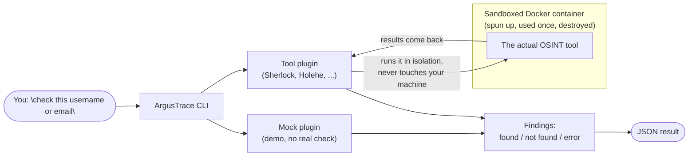

# ArgusTrace


A modular OSINT framework. This is an early-stage skeleton proving out the
core pipeline — entity in, plugin runs, structured findings out — before any
scheduler, correlation engine, scoring, graph, or REST API gets built on top.

## Architecture



Any failure inside the container (timeout, docker missing, bad output) is
caught by `SherlockPlugin` and turned into a `Finding(status=ERROR)` — it
never propagates as an exception.

## Core design

- **`Status` is tri-state, not a boolean.** `FOUND` / `NOT_FOUND` / `ERROR`.
  `NOT_FOUND` means "checked, doesn't exist." `ERROR` means "could not check"
  (timeout, rate-limit, crash). Never conflate the two — an `ERROR` reported
  as `NOT_FOUND` is a false negative.
- **`Plugin` is a `Protocol`**, not a base class: `name`, `supported_entities`,
  and `async def run(entity: str) -> list[Finding]`. Any object with that
  shape works as a plugin, no inheritance required.
- **Every plugin must catch its own failures.** `run()` should never raise —
  timeouts, missing binaries, bad output, etc. must come back as a
  `Finding(status=ERROR)` so one broken plugin can't take down a run.

## Project layout

```
argustrace/
├── core/
│   └── models.py       # Status, Finding
├── plugins/
│   ├── base.py          # Plugin protocol
│   ├── _docker_runner.py  # shared hardened `docker run` helper
│   ├── mock_plugin.py   # hardcoded findings, no I/O — proves the pipeline
│   ├── sherlock_plugin.py  # runs Sherlock in a hardened Docker container
│   └── holehe_plugin.py    # runs Holehe in a hardened Docker container
└── cli.py                # `investigate` command

docker/
└── holehe/
    └── Dockerfile        # builds argustrace-holehe (no official image exists)
```

## Setup

Dependencies are managed with [uv](https://docs.astral.sh/uv/); `uv.lock`
pins exact versions and hashes for every package.

```bash
uv sync
```

Docker Desktop (or another Docker engine) must be running for the `sherlock`,
`sherlock-full`, and `holehe` plugins.

Sherlock is pulled straight from a pinned registry image. Holehe has no
official image, so it must be built locally once:

```bash
docker build -t argustrace-holehe:1.61 -f docker/holehe/Dockerfile .
```

## Usage

```bash
uv run python -m argustrace.cli <entity> --plugin mock             # no network, proves the pipeline
uv run python -m argustrace.cli <username> --plugin sherlock       # curated ~10-site list, a few seconds
uv run python -m argustrace.cli <username> --plugin sherlock-full  # full ~400+ site scan, 1-3 minutes
uv run python -m argustrace.cli <email> --plugin holehe             # ~120 sites, ~10 seconds
```

Output is a JSON array of `Finding` objects.

## The Sherlock plugin

[Sherlock](https://github.com/sherlock-project/sherlock) never runs on the
host. It's invoked through `docker run` against an image pinned by SHA256
digest, with:

- `--cap-drop=ALL`, `--security-opt=no-new-privileges`
- `--read-only` root filesystem (only the output volume is writable)
- Memory, CPU, and PID limits

Sherlock's own per-site result is mapped onto our `Status`:

| Sherlock status  | `Status`                                                     |
| ---------------- | ------------------------------------------------------------ |
| `Claimed`        | `FOUND`                                                      |
| `Available`      | `NOT_FOUND`                                                  |
| `Unknown`, `WAF` | `ERROR`                                                      |
| `Illegal`        | dropped (username invalid for that site — no check happened) |

## The Holehe plugin

[Holehe](https://github.com/megadose/holehe) checks whether an email is
registered on ~120 sites via their "forgot password" flow. Same isolation
as Sherlock (`--cap-drop=ALL`, `--read-only`, `--security-opt=no-new-privileges`,
resource limits), but built from a local Dockerfile pinned to a specific
`pip` version and base image digest, since no official image exists.

Holehe's own per-site result is mapped onto our `Status`:

| Holehe result                | `Status`    |
| ----------------------------- | ----------- |
| `rateLimit: True`             | `ERROR`     |
| `exists: True`                | `FOUND`     |
| `exists: False`, no rate limit | `NOT_FOUND` |

Note: Holehe's own code treats *any* exception raised while checking a site
(network error, parsing failure, actual rate limiting, ...) as `rateLimit:
True` — it's a catch-all, not a precise signal, which is exactly why our
`ERROR` status exists as a separate bucket from `NOT_FOUND`.

The plugin deliberately never passes `--timeout` to Holehe: in v1.61,
argparse stores an explicit value as a string instead of an int, which
makes every single module raise immediately. Omitting the flag keeps the
(int) default and avoids the bug entirely.

## Testing

```bash
uv run pytest -v
```

Tests lock the `Status`/`Finding`/`Plugin` contracts using `MockPlugin`, plus
the entity validation and CSV-to-`Status` mapping logic of the Sherlock and
Holehe plugins against fixture data — none of it needs Docker or network
access. Actually running Sherlock/Holehe against real targets is exercised
manually, not in the automated suite.
