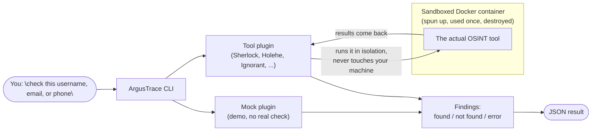

# ArgusTrace


A modular OSINT framework. This is an early-stage skeleton proving out the
core pipeline — entity in, plugin runs, structured findings out — before any
scheduler, correlation engine, scoring, graph, or REST API gets built on top.

## Architecture



Any failure inside the container (timeout, docker missing, bad output) is
caught by the plugin and turned into a `Finding(status=ERROR)` — it never
propagates as an exception.

## Core design

- **`Status` is tri-state, not a boolean.** `FOUND` / `NOT_FOUND` / `ERROR`.
  `NOT_FOUND` means "checked, doesn't exist." `ERROR` means "could not check"
  (timeout, rate-limit, crash). Never conflate the two — an `ERROR` reported
  as `NOT_FOUND` is a false negative.
- **`Plugin` is a `Protocol`**, not a base class: `name`, `supported_entities`,
  and `async def run(entity: str, options: dict | None = None) -> list[Finding]`.
  Any object with that shape works as a plugin, no inheritance required.
  `options` carries real, per-tool CLI flags (declared in `TOOL_FAMILIES`,
  see below) — a plugin with nothing meaningful to expose just ignores it.
- **Every plugin must catch its own failures.** `run()` should never raise —
  timeouts, missing binaries, bad output, etc. must come back as a
  `Finding(status=ERROR)` so one broken plugin can't take down a run.

## Project layout

```
argustrace/
├── core/
│   └── models.py       # Status, Finding
├── plugins/
│   ├── base.py          # Plugin protocol
│   ├── registry.py      # PLUGINS + TOOL_FAMILIES, shared by the CLI and the API
│   ├── _docker_runner.py  # shared hardened `docker run` helper
│   ├── mock_plugin.py   # hardcoded findings, no I/O — proves the pipeline
│   ├── sherlock_plugin.py  # runs Sherlock in a hardened Docker container
│   ├── maigret_plugin.py   # runs Maigret in a hardened Docker container
│   ├── holehe_plugin.py    # runs Holehe in a hardened Docker container
│   ├── ignorant_plugin.py  # runs Ignorant in a hardened Docker container
│   ├── crtsh_plugin.py     # queries crt.sh (Certificate Transparency) in a container
│   └── theharvester_plugin.py  # runs theHarvester in a hardened Docker container
├── versioning.py         # on-demand PyPI/Docker Hub/GitHub release checks
├── cli.py                # `investigate` command
└── api.py                # FastAPI app: /api/plugins, /api/investigate, /api/tools/{family}/version-check

docker/
├── holehe/
│   └── Dockerfile        # builds argustrace-holehe (no official image exists)
├── ignorant/
│   ├── Dockerfile        # builds argustrace-ignorant (no official image exists)
│   └── ignorant_json.py  # thin wrapper: calls ignorant's library directly, prints JSON
├── crtsh/
│   └── Dockerfile        # minimal alpine+curl image, just fetches crt.sh's JSON API
└── theharvester/
    └── Dockerfile        # clones the official repo at a pinned tag, CLI entrypoint

web/                      # React + Vite frontend, calls the FastAPI backend
```

## Setup

Dependencies are managed with [uv](https://docs.astral.sh/uv/); `uv.lock`
pins exact versions and hashes for every package.

```bash
uv sync
```

Docker Desktop (or another Docker engine) must be running for every
plugin except `mock`.

Sherlock and Maigret are pulled straight from pinned registry images.
Holehe, Ignorant, crt.sh, and theHarvester have no official image, so
each must be built locally once:

```bash
docker build -t argustrace-holehe:1.61 -f docker/holehe/Dockerfile .
docker build -t argustrace-ignorant:1.2 -f docker/ignorant/Dockerfile .
docker build -t argustrace-crtsh:1.0 -f docker/crtsh/Dockerfile .
docker build -t argustrace-theharvester:4.11.1 -f docker/theharvester/Dockerfile .
```

The web frontend needs Node.js/npm; install its dependencies once:

```bash
cd web && npm install
```

## Usage

```bash
uv run python -m argustrace.cli <entity> --plugin mock                  # no network, proves the pipeline
uv run python -m argustrace.cli <username> --plugin sherlock            # curated ~10-site list, a few seconds
uv run python -m argustrace.cli <username> --plugin sherlock-full       # full ~400+ site scan, 1-3 minutes
uv run python -m argustrace.cli <username> --plugin maigret             # top ~15 sites, a few seconds
uv run python -m argustrace.cli <username> --plugin maigret-full        # full ~3000+ site scan, several minutes
uv run python -m argustrace.cli <email> --plugin holehe                 # ~120 sites, ~10 seconds
uv run python -m argustrace.cli <phone> --plugin ignorant                # 3 sites, E164 format e.g. +33612345678
uv run python -m argustrace.cli <domain> --plugin crtsh                  # Certificate Transparency logs
uv run python -m argustrace.cli <domain> --plugin theharvester           # 1 free passive-recon source
uv run python -m argustrace.cli <domain> --plugin theharvester-broad     # 4 free sources combined
```

Output is a JSON array of `Finding` objects.

## Web app

A FastAPI backend + React/Vite frontend expose the same `PLUGINS` /
`TOOL_FAMILIES` registry as the CLI, so there's exactly one place a plugin
is registered. Run both in separate terminals:

```bash
uv run uvicorn argustrace.api:app --port 8000    # backend: http://127.0.0.1:8000
cd web && npm run dev                             # frontend: http://localhost:5173
```

Requests block until the plugin finishes (same as the CLI; no background
job queue yet, so `sherlock-full` will hold the request open for 1-3
minutes). FastAPI's interactive docs are at `http://127.0.0.1:8000/docs`.

Built to stay usable well past today's 7 tools:

- **Search + filter tool browser** (`ToolBrowser.jsx`): a text search over
  name/description, entity-type filter chips, and a "fast only" toggle,
  rendering compact single-line rows instead of a card grid. No
  virtualization or server-side search — verified to hold up fine at a
  simulated ~200 rows with plain client-side filtering; the card grid's
  actual scaling problem was per-card footprint, not row count.
- **Advanced options** (`AdvancedOptionsPanel.jsx`): a form generated from
  each family's `options` schema (int/str/bool/enum/enum_multi, each with
  a description and a required/optional tag), collapsed by default. Only
  real, safe CLI flags are exposed — nothing that only makes sense for a
  format we don't use (`--html`, `--pdf`, ...) or that needs an API key we
  don't provision.
- **Fast badge**: a boolean `fast` per variant (kept alongside the
  existing human-readable `speed` string) shown as a small ⚡ badge.
- **Version badges** (`VersionBadge.jsx`): green/orange/red/gray pill per
  tool, plus a "Check version" button. Checking is **on-demand, per tool**
  — there is no background refresh or scheduler; a server restart resets
  every badge to gray until re-checked by hand. See "Version checking"
  below.
- **Tool info pages** (`/tools/:family`, via `react-router-dom`):
  description, GitHub/docs links, variants, options, example entities,
  and a "Use this tool" button that hands off to `/` with that family and
  variant preselected via query params (`?family=...&variant=...`).

## Version checking

Each tool family declares a `version_check` (`argustrace/versioning.py`):
`pypi` (package name), `dockerhub` (repository), `github_releases` (repo),
or `none` for things that aren't a versioned tool at all — crt.sh (a live
web service) and the mock demo. Checking is triggered per tool by a human
clicking "Check version" (`POST /api/tools/{family}/version-check`); there
is **no scheduler and no auto-refresh** — that was ruled out early in this
project, and a version check is no exception. Results are cached in
memory only (no persistence), so a restart resets every badge to gray.

Status is classified by *index* in the real, fetched release list (newest
first), not semver arithmetic: pinned == latest → current; one behind →
behind; more than one behind → outdated; pinned not found in the fetched
list (renamed, yanked, or a partial fetch) → **unknown, never a guessed
"outdated"**. Any network/HTTP failure is caught at the checker boundary
and also becomes unknown — the same discipline this project already
applies to Docker failures (`ok=False` → `ERROR`, never an inferred
negative result), applied here to version staleness.

One real gap this surfaced: Sherlock and Maigret are pinned by Docker
image **digest**, not a version string, so each has a `pinned_version`
constant recorded separately in `registry.py` next to the digest — bumping
one must bump the other by hand. Maigret's own Docker tags turned out to
be git-commit SHAs (not semver), discovered by checking the real Docker
Hub API before wiring anything up — its version is checked via PyPI
instead, where the project does publish clean semver releases.

## The Sherlock plugin

[Sherlock](https://github.com/sherlock-project/sherlock) never runs on the
host. It's invoked through `docker run` against an image pinned by SHA256
digest, with:

- `--cap-drop=ALL`, `--security-opt=no-new-privileges`
- `--read-only` root filesystem (only the output volume is writable)
- Memory, CPU, and PID limits

Sherlock's own per-site result is mapped onto our `Status`:

| Sherlock status  | `Status`                                                     |
| ---------------- | ------------------------------------------------------------ |
| `Claimed`        | `FOUND`                                                      |
| `Available`      | `NOT_FOUND`                                                  |
| `Unknown`, `WAF` | `ERROR`                                                      |
| `Illegal`        | dropped (username invalid for that site — no check happened) |

## The Maigret plugin

[Maigret](https://github.com/soxoj/maigret) is like Sherlock but with a
much larger site database (3000+ vs ~400) and metadata extraction from
claimed profiles. Pulled from a pinned registry image, same hardening as
Sherlock, plus `-e HOME=/tmp`: Maigret writes its config/database cache
to `$HOME/.maigret` on startup, which fails under `--read-only` at the
default `/root` home.

Maigret's JSON/ndjson report only ever includes `Claimed` (found) sites —
confirmed by reading `generate_json_report` in its source, which hard-skips
anything else. The CSV report doesn't have that limitation, so the plugin
uses `--csv` instead, giving the same three statuses as Sherlock:

| Maigret status | `Status`                        |
| --------------- | -------------------------------- |
| `Claimed`       | `FOUND`                          |
| `Available`     | `NOT_FOUND`                      |
| `Unknown`       | `ERROR` (bot protection, blocked, connection error, etc.) |

## The Holehe plugin

[Holehe](https://github.com/megadose/holehe) checks whether an email is
registered on ~120 sites via their "forgot password" flow. Same isolation
as Sherlock (`--cap-drop=ALL`, `--read-only`, `--security-opt=no-new-privileges`,
resource limits), but built from a local Dockerfile pinned to a specific
`pip` version and base image digest, since no official image exists.

Holehe's own per-site result is mapped onto our `Status`:

| Holehe result                | `Status`    |
| ----------------------------- | ----------- |
| `rateLimit: True`             | `ERROR`     |
| `exists: True`                | `FOUND`     |
| `exists: False`, no rate limit | `NOT_FOUND` |

Note: Holehe's own code treats *any* exception raised while checking a site
(network error, parsing failure, actual rate limiting, ...) as `rateLimit:
True` — it's a catch-all, not a precise signal, which is exactly why our
`ERROR` status exists as a separate bucket from `NOT_FOUND`.

The plugin deliberately never passes `--timeout` to Holehe: in v1.61,
argparse stores an explicit value as a string instead of an int, which
makes every single module raise immediately. Omitting the flag keeps the
(int) default and avoids the bug entirely.

## The Ignorant plugin

[Ignorant](https://github.com/megadose/ignorant) checks whether a phone
number is registered on Amazon, Instagram, and Snapchat — same author and
design as Holehe, same isolation model, also built from a local Dockerfile
(no official image exists).

Ignorant's CLI has no CSV/JSON export, so the image bakes in a small
wrapper ([`ignorant_json.py`](docker/ignorant/ignorant_json.py)) that
calls the library's own scan functions directly and prints JSON — more
reliable than parsing colored terminal output. Same status mapping as
Holehe: `rateLimit: true` → `ERROR`, `exists: true` → `FOUND`, otherwise
`NOT_FOUND`.

Entities are parsed with the [`phonenumbers`](https://pypi.org/project/phonenumbers/)
library (Google's libphonenumber) rather than a hand-rolled regex —
splitting a raw number like `+33612345678` into country code (`33`) and
national number (`612345678`) isn't reliably doable with pattern matching,
since country codes vary from 1 to 3 digits with no delimiter in the string.

**Why not PhoneInfoga?** It was the first candidate, but its free (no
API key) scanners don't actually check anything — the "OSINT" scanner
just generates Google search URLs (e.g. `site:instagram.com intext:"+1..."`)
for a human to open and read themselves, and the "local" scanner only
validates formatting/carrier, with no found/not-found signal at all.
Forcing that into `FOUND`/`NOT_FOUND` would misrepresent what was actually
verified, which is exactly what the tri-state `Status` exists to prevent.

## The crt.sh plugin

[crt.sh](https://crt.sh) is a public Certificate Transparency log search
service, not a tool — the plugin just makes an HTTP GET to its JSON API
(`?q=<domain>&output=json`). There's no third-party tool code to isolate
here, but it still runs through a container (a minimal Alpine + curl
image) for consistency with every other plugin.

Every certificate name found means "this subdomain exists" — there's no
per-candidate check the way Sherlock has one, so the mapping is: any
result → one `FOUND` Finding per unique subdomain (deduped across
reissues and multi-SAN certificates); an empty result → one `NOT_FOUND`
Finding; a request failure → `ERROR`.

crt.sh is a free, community-run service backed by a single database and
is **frequently overloaded** — we hit 502s, 404s, and hung connections
repeatedly just testing this plugin. The plugin retries once after a
short delay before giving up, which noticeably cuts the failure rate;
if both attempts fail, it still reports `ERROR` honestly rather than
hiding it or retrying forever.

## The theHarvester plugin

[theHarvester](https://github.com/laramies/theHarvester) aggregates
subdomains/hosts for a domain from passive recon sources. No official
Docker image exists, so the image clones the official repo at a pinned
release tag (`4.11.1`) and builds it with `uv sync --locked` exactly like
their own Dockerfile, just swapping the entrypoint from the REST server
(`restfulHarvest`) to the CLI (`theHarvester`). Also needs `-e HOME=/tmp`
(same reason as Maigret: default proxies.yaml written on first run).

Only free, no-API-key sources are used. Two variants:

- `theharvester`: a single source (`rapiddns`).
- `theharvester-broad`: four sources combined (`rapiddns,otx,hackertarget,crtsh`).

Like crt.sh, this is a discovery tool rather than a per-candidate check:
every host/IP/email theHarvester reports becomes a `FOUND` Finding; no
results at all → `NOT_FOUND`; a failed run → `ERROR`.

## Testing

```bash
uv run pytest -v
```

Tests lock the `Status`/`Finding`/`Plugin` contracts using `MockPlugin`,
the entity validation, option-composition (default/custom/clamped), and
result-to-`Status` mapping logic of every real plugin, and the version
classification rules in `test_versioning.py` (current/behind/outdated/
unknown-on-error/pinned-not-found, with `httpx.MockTransport` standing in
for PyPI/Docker Hub/GitHub) — none of it needs Docker or network access.
Actually running these tools and their live version checks against real
targets is exercised manually, not in the automated suite.
